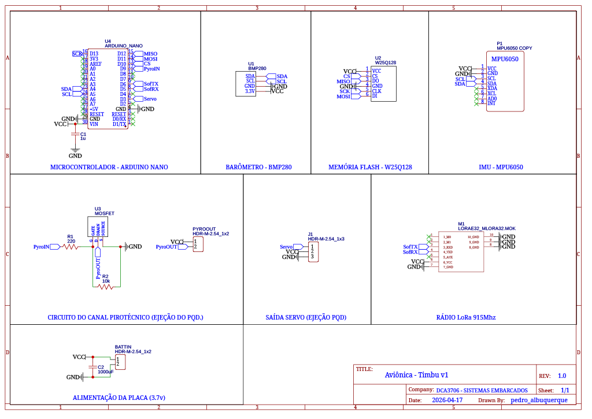

# Aviônica Arduino — Relatório Técnico

**Disciplina:** Sistemas Embarcados  
**Atividade:** Trabalho Complementar — Dinâmica 2 (Projeto Embarcado Livre)

---

## 1. Descrição do Problema

O sistema implementa a aviônica embarcada de um foguete experimental, responsável por:
- Aquisição contínua de dados inerciais e barométricos durante o voo
- Armazenamento local em memória flash não-volátil
- Transmissão de telemetria em tempo real para estação de solo via rádio LoRa
- Detecção automática das fases do voo através de máquina de estados
- Acionamento da ejeção do paraquedas, com suporte a dois métodos distintos:
  - Ejeção pirotécnica: realizada por meio de um canal dedicado com MOSFET em configuração low-side, utilizado para acionamento de ignitores.
  - Ejeção mecânica: realizada por servo motor.

Essa implementação opera sem sistema operacional (bare-metal).

---

## 2. Lista de Componentes

| Componente | Especificação |
|---|---|
| Microcontrolador | Arduino Nano (ATmega328P, 16MHz, 2KB RAM, 32KB Flash) |
| IMU | MPU-6050 — acelerômetro ±8g + giroscópio ±500°/s, I²C 0x68 |
| Barômetro | BMP280 — pressão 300-1100hPa, altitude relativa, I²C 0x76 |
| Rádio | LoRa E32-915MHz — UART 9600bps, alcance ~3km |
| Memória | W25Q128 — Flash SPI 16MB, 100.000 ciclos de escrita |
| Canal Pirotécnico (Ejeção) | MOSFET canal N (low-side) - resistor de gate 220Ω + pull-down |

---

## 3. Montagem

Diagrama de conexões:

```
Arduino Nano
├── I²C  (A4=SDA, A5=SCL) ──── MPU-6050 (0x68)
│                          └── BMP280   (0x76)
├── SPI  (D11=MOSI, D12=MISO, D13=SCK)
│   └── D10 (CS) ───────────── W25Q128
├── SoftwareSerial
│   ├── D6 (SoftTX) ────────── LoRa E32 RX
│   └── D5 (SoftRX) ────────── LoRa E32 TX
├── D9 ─────────────────────── Canal Pirotécnico
├── D3 ─────────────────────── Saída Servo
```

---

## 4. Esquemático



---

## 5. Código

O projeto é organizado nos seguintes arquivos:

| Arquivo | Responsabilidade |
|---|---|
| `globals.hpp` | Pinout, thresholds, structs e enum de estados |
| `sensors.hpp/.cpp` | Leitura do MPU-6050 e BMP280 via I²C |
| `storage.hpp/.cpp` | Gravação e dump na flash W25Q128 via SPI |
| `telemetry.hpp/.cpp` | Transmissão de pacotes via LoRa E32 |
| `statemachine.hpp/.cpp` | Máquina de estados do voo |
| `ejection.hpp/.cpp` | Controla o sistema de ejeção do foguete |
| `avionica_arduino.ino` | Loop principal, ISRs e configuração de registradores |

### Bibliotecas utilizadas
- `Adafruit MPU6050`
- `Adafruit BMP280`
- `Adafruit Unified Sensor`
- `SPIMemory`
- `SoftwareSerial` (built-in)

### Estruturas de dados centrais

```cpp
// Registro completo gravado na flash
struct DadosVoo {
    float acelX, acelY, acelZ;   // m/s²
    float giroX, giroY, giroZ;   // °/s
    float pressao;                // hPa
    float temperatura;            // °C
    float altitude;               // metros
    unsigned long timestamp;      // millis()
    EstadoVoo estado;             // fase do voo
};

// Pacote reduzido transmitido pelo LoRa
struct PacoteTelemetria {
    float acelX, acelY, acelZ;
    float altitude;
    unsigned long timestamp;
    EstadoVoo estado;
};
```

### Capacidade de armazenamento

```
sizeof(DadosVoo) ≈ 45 bytes
Capacidade W25Q128 = 16.777.216 bytes
Registros máximos  = ~372.827 registros
Frequência de gravação = 25Hz
Tempo máximo de voo  = ~14.913s ≈ 4,1 horas
```

### Fases do voo (máquina de estados)

- **ARMADO**: estado inicial após energização. O sistema aguarda a detecção de lançamento, monitorando aceleração. A transição ocorre quando a aceleração ultrapassa ~3g.

- **ALTA_ENERGIA**: fase de subida propulsada. Caracterizada por aceleração elevada devido ao empuxo do motor. O sistema permanece neste estado enquanto a aceleração se mantém acima de ~1.2g.

- **BAIXA_ENERGIA**: fase após o término da queima do motor (coast). A aceleração reduz significativamente e o foguete continua subindo por inércia. A transição ocorre quando a altitude começa a diminuir em relação ao apogeu estimado.

- **QUEDA**: fase descendente após o apogeu. Identificada quando a altitude cai alguns metros abaixo do valor máximo registrado. Neste estado ocorre o acionamento do sistema de ejeção do paraquedas.

- **ATERRISSADO**: estado final. Detectado quando a altitude se aproxima do solo (abaixo de ~5 m), indicando que o voo foi concluído.

## 6. Descrição

### 6.1 Sensores — Aquisição Periódica (MPU-6050 + BMP280)

A leitura dos sensores é realizada de forma periódica no loop principal, com MPU-6050 e BMP280 sendo amostrados na mesma frequência.

Como o BMP280 possui menor taxa de atualização, ele define a frequência de aquisição do sistema, garantindo que cada ciclo produza um conjunto consistente de dados.

**Motivação:** simplificar o firmware e evitar leituras redundantes do MPU-6050, mantendo sincronização entre os dados sem uso de interrupções.

### 6.2 Armazenamento — SPI via Biblioteca

O módulo W25Q128 utiliza o periférico SPI nativo do ATmega328P (pinos fixos D11, D12, D13), gerenciado pela biblioteca `SPIMemory`.

O pino `CS` (D10) é controlado pela biblioteca, que usa `digitalWrite` internamente. A decisão de não reimplementar o driver SPI via registradores é justificada pela complexidade do protocolo de comandos do W25Q128 (erase, page program, status polling), que está encapsulada e testada na biblioteca.

**Custo de gravação:** 45 bytes × 8 bits / 8MHz = **720 clocks por registro**.

### 6.3 Transmissão — Controle do LoRa E32

*Seção em desenvolvimento.*

## 7. Resultados e Discussão

### Validação do funcionamento

O sistema foi projetado e validado conceitualmente com base nas especificações dos componentes. A arquitetura de software foi estruturada para garantir:

- Aquisição periódica sincronizada entre MPU-6050 e BMP280
- Registro contínuo dos dados em memória flash não-volátil
- Transmissão de telemetria em tempo real (limitada) via LoRa
- Detecção das fases de voo por máquina de estados
- Acionamento do sistema de ejeção conforme condições de voo

### Limitações encontradas

- **Banda de transmissão limitada:** o LoRa permite envio de poucos pacotes em tempo real; a maior parte dos dados é armazenada localmente
- **Risco em falhas de energia:** em caso de desligamento inesperado, dados podem ser sobrescritos ou perder referência de posição na memória
- **Uso de polling:** a aquisição baseada em varredura periódica é menos eficiente que abordagens orientadas a eventos/interrupções
- **Execução bloqueante:** ausência de controle mais refinado pode permitir que certas rotinas atrasem outras operações críticas

### Melhorias possíveis

- Otimização das estruturas de dados para reduzir uso de memória e aumentar eficiência de gravação
- Implementação de um modelo de tarefas (scheduler simples) para coordenar aquisição, armazenamento e transmissão
- Garantia de não bloqueio nas rotinas críticas, especialmente durante aquisição de dados
- Implementação de mecanismo de persistência que permita continuidade do registro mesmo após falhas de energia